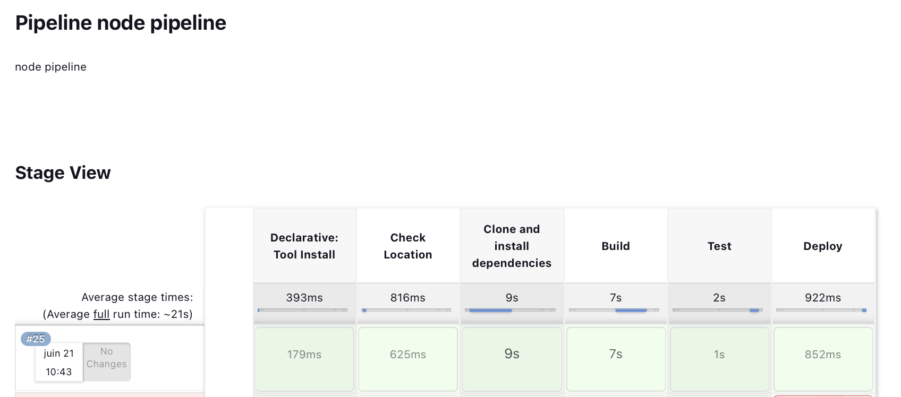
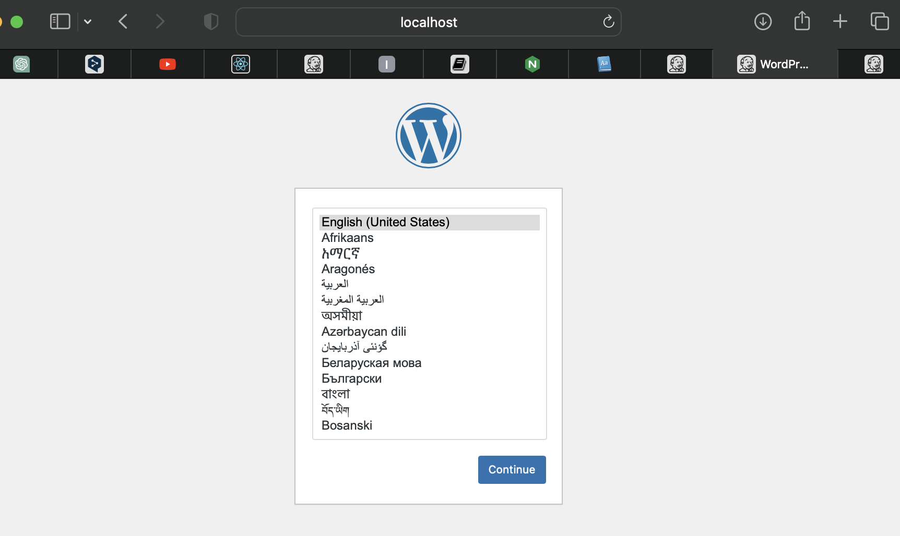
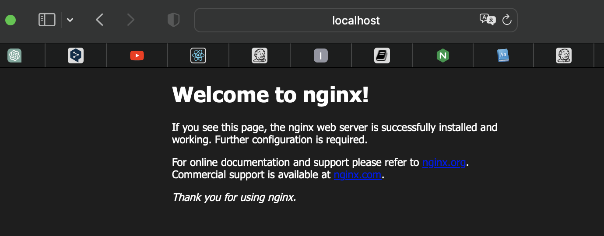

# LABs & PRJ DevOps
## Efrei Paris M1 SE1 Group 4

### LAB1
#### cf1. : https://www.youtube.com/watch?v=xWCQpSDArb4&ab_channel=QASCRIPT
#### cf2. : https://www.youtube.com/watch?v=7KCS70sCoK0&ab_channel=TechWorldwithNana
#### cf3. : https://github.com/SimonMartinenq/DevOps/tree/Jenkinsfile
#### cf4. : https://rdarida.medium.com/installing-jenkins-on-localhost-with-vagrant-8aa59761bec
#### steps :
1. Install VirtualBox and vagrant
2. Create a folder and put into the folder the Vagrantfile and the jenkins.sh
3. Go to that folder and run commands below :
    - vagrant up / vagrant provision
    - vagrant ssh
    - sudo add-apt-repository ppa:openjdk-r/ppa
    - sudo apt-get update
    - sudo apt-get install openjdk-11-jdk
4. Check the status of jenkins by running : systemctl status jenkins
5. Go to the browser (localhost:8080) and start configure jenkins by the link (cf4.)
6. Follow the link (cf1.) to deploy this NodeJS project by copying the pipeline script on the Jenkinsfile into the browser pipeline script section
7. Go to the browser's main page and run a build then can get the below result1
#### result1 :

### LAB2
#### steps :
1. Install Docker through Vagrant
    - Install VirtualBox and Vagrant
    - Create a new directory called Docker
    - Initialize a new Vagrantfile by running : vagrant init ubuntu/bionic64
    - Go to the newly created Vagrantfile and edit it by adding one line : config.vm.provision "docker"
    - Run the VM with : vagrant up
    - SSH into the VM : vagrant ssh
    - Check the installation of Docker with : sudo docker --version

2. Create our first docker container and connect to the host
    - Ensure in the VM
    - Pull a Docker image (such as Ubuntu) with : sudo docker pull ubuntu
    - Run a Docker container using Ubuntu and then connect to it by running : sudo start run -it ubuntu /bin/bash
    - Check if the container is newly started 
    - Exit the current container by running : exit
    - Install Docker Compose : sudo apt-get install -y curl
                               sudo curl -L "https://github.com/docker/compose/releases/download/1.29.2/docker-compose-$(uname -s)-$(uname -m)" -o /usr/local/bin/docker-compose
                               sudo chmod +x /usr/local/bin/docker-compose
    - Create a Docker Compose file named "docker-compose.yml" under the docker folder
    - Edit the file by running : nano docker-compose.yml
    - Copying the content into the editor and save all
    - Configure in Vagrantfile with 1234 as host port and 8080 as guest port
    - Start the Docker Compose services by running : docker-compose up -d
    - Go to the browser (localhost:1234) and see if the wordpress page exists
    - Check the result2 as below
#### result2 :

3. Deploy Nginx and configure it
    - Restart all with : vagrant reload, vagrant ssh
    - Pull image with : sudo docker pull nginx
    - Configure in Vagrantfile with 1235 as host port and 8080 as guest port
    - Restart all with : vagrant reload, vagrant ssh
    - Create a new Nginx container by running : sudo docker run --name my-nginx -p 8081:80 -d nginx
    - Go to the browser (localhost:1235) and see if the Nginx page exists
    - Check the result3 as below
#### result3 :

### LAB3
